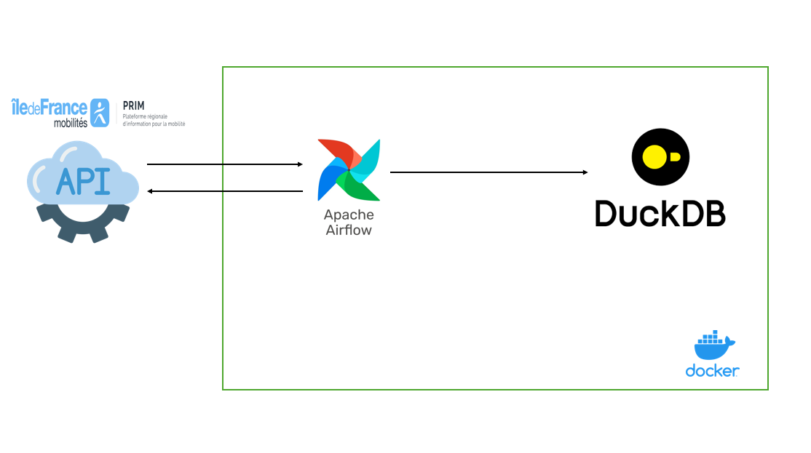

# apprendre_airflow
Ce petit tuto airflow m'a permis de découvrir et de comprendre comment fonctionne airflow, j'ai pu profiter de ce cours pratique pour développer un pipeline qui ingère les données provenant d'une API qui s'appelle PRIM (Plateforme Régionale d'Information pour la Mobilité) et les stocke dans une BDD DuckDB.

## Composants du pipeline

Data Source: La plate forme PRIM [LIEN](https://prim.iledefrance-mobilites.fr/)
Apache Airflow : Orchestre pipeline et programme l'ingestion des données
DuckDB: Stocke les données ingérées par le pipeline

Scripts :

dag.py -> Contient le DAG Airflow qui requête l'API, [PRIM](https://prim.iledefrance-mobilites.fr/)

