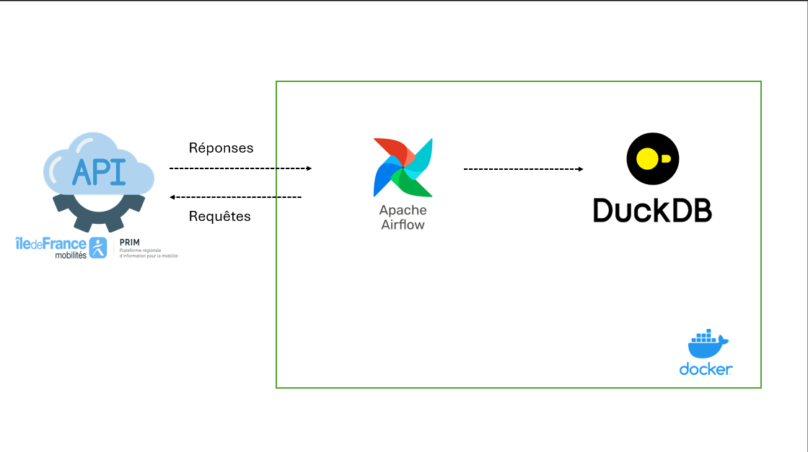

# apprendre_airflow
Ce petit tuto airflow m'a permis de découvrir et de comprendre comment fonctionne airflow, j'ai pu profiter de ce cours pratique pour développer un pipeline qui ingère les données provenant d'une API qui s'appelle PRIM (Plateforme Régionale d'Information pour la Mobilité) et les stocke dans une BDD DuckDB.

## Composants du pipeline

__Data Source__: La plate forme [PRIM](https://prim.iledefrance-mobilites.fr/)  
__Apache Airflow__ : Orchestre pipeline et programme l'ingestion des données  
__DuckDB__: Stocke toutes les données ingérées et les colonnes filtrées du pipeline  
__Docker__:  Encapsule et isole Airflow et DuckDB dans des conteneurs, garantissant un environnement reproductible, cohérent et facilement déployable pour l’exécution du pipeline de récupération et de stockage des données.

Scripts :

**dag.py** -> Contient le DAG Airflow qui requête l'API, [PRIM](https://prim.iledefrance-mobilites.fr/), ensuite reçoit une réponse en JSON, puis filtre les colonnes souhaitées et enfin les normalise sous forme tabulaire pour être insérées dans __DuckDB__.

## Départ

### 1- Télécharger et installer :  

Docker destop ( plus pratique pour mieux gérer les conteneurs en développement local)  
Dbeaver pour notre base de données DuckDB  

### 2- Télécharger et installer un IDE de votre choix (VS Code, Intellij)

### 3- Faire un clone du repertoire projet sur votre environnement locale 

`git clone https://github.com/tchanatf/apprendre_airflow.git`  

### 4- Ouvrir le projet a partir de votre IDE et ensuite dans le terminal de votre IDE, naviguer jusqu'au répertoire principale nommé *apprendre_airflow*  

`cd apprendre_airflow`  

### 5- Installer les packages nécessaires dans le fichier *require.txt*  

`pip install -r .\require.txt`

### 6- Ensuite démarrer les services à l'aide du fichier *docker-compose.yml*  

`docker compose up -d`  
[SERVICE DOCKER](images/launch_image_docker.png)  

### 7- Verifier la liste des conteneurs lancés:

Par terminal : [LISTE CONTENEUR](images/image_list_docker_process.png)  

Sur Docker Destop : [LISTE CONTENEUR](images/containers_dockers.png)

### 8- Acceder à l'interface utilisateur de Airflow avec l'adresse localhost:8080 avec les identifiant suivant :
__user__: *admin* 
__mot de passe__ : *admin*  

En cliquant sur le bouton *executer* on peut voir que les différentes tâches du pipeline s'execute avec succès, et on peut notamment visualiser le graphe:  

[INTERFACE AIRFLOW](images/image_dag_airflow.png)  

### 9 

